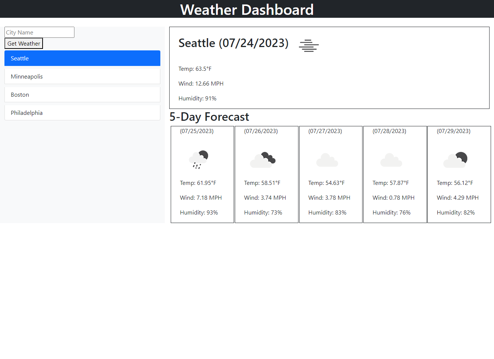

# <Challenge 6: Weather Dashboard>

At time of publication, the project can be found deployed at https://dopalescent.github.io/Weather-Dashboard/

- The following screenshot previews the deployed project:

## Credits

- Penn LPS Boot Camp program for education and resources
- OpenWeather for their geocoding and weather data APIs
- Day.js for their date and time library
- EdX and The Full-Stack Blog for their 'Professional README Guide' article